# Testimonial SaaS

A small SaaS for collecting customer testimonials. Each owner creates a **Space** and shares its public link, where customers submit a testimonial without creating an account. The owner moderates submissions in an inbox and embeds a **Wall of Love** on any website. There are two plans: Free and Pro.

## Tech stack

- **Laravel 13** (PHP), with Fortify for authentication
- **Inertia.js + React 19** (TypeScript)
- **Tailwind CSS v4 + shadcn/ui**
- **SQLite** locally, **MySQL 8** (tested in CI)
- **Laravel Cashier (Stripe)** for subscriptions
- **Pest / PHPUnit** for tests
- **OpenSpec** for spec-driven development

## Requirements

- PHP 8.3+ (for example, [Laravel Herd](https://herd.laravel.com) on Windows/macOS)
- Composer 2
- Node 22+

## How to run

Run these commands inside the project folder. They work in Windows PowerShell or cmd:

```
composer install
npm install
copy .env.example .env      (macOS/Linux: cp .env.example .env)
php artisan key:generate
php artisan migrate --seed
composer dev
```

Then open <http://localhost:8000>.

`composer dev` starts the Laravel web server, a queue worker and the Vite dev server together.

**Demo logins** (password `password` for both):

| Email                | Plan                |
| -------------------- | ------------------- |
| `maya@brightcopy.co` | Free plan, 2 Spaces |
| `dev@shiplog.io`     | Pro plan            |

Locally, mail is written to the log (`MAIL_MAILER=log`), so new accounts are auto-verified. You can register a fresh account without a mail server.

## Running the checks

```
php artisan test                               # 370 Pest tests
vendor/bin/pint --test                         # PHP code style
vendor/bin/phpstan analyse --memory-limit=512M # static analysis (Larastan)
npm run check                                  # oxlint + oxfmt
npm run types:check                            # TypeScript
```

GitHub Actions (`.github/workflows/tests.yml`) runs these checks against both SQLite and MySQL 8.

## Features

| Area                   | What it covers                                                                                                                                                                                                                                                                                  | Status |
| ---------------------- | ----------------------------------------------------------------------------------------------------------------------------------------------------------------------------------------------------------------------------------------------------------------------------------------------- | ------ |
| Authentication         | Register, login, logout, password reset, email verification, two-factor auth, passkeys                                                                                                                                                                                                          | ✅     |
| Spaces                 | Create / edit / delete; title, subtitle and the question shown to customers; per-field mode **Off / Optional / Required** for Address, Company, Social link, Profile photo and custom fields; star-rating toggle; themes **Minimal / Modern / Clean**; success page with a copyable public link | ✅     |
| Public submission page | `/s/{public_id}`: no account needed, optional social-sharing consent, profile photo upload, server-side validation, "Boom!" confirmation                                                                                                                                                        | ✅     |
| Inbox                  | Favorite, add to Wall of Love, edit, hide/show, delete with confirmation, `…` actions menu                                                                                                                                                                                                      | ✅     |
| Dashboard analytics    | Totals, average rating, submissions per day (7 / 30 / 90 days / all time), rating distribution, upgrade banner                                                                                                                                                                                  | ✅     |
| Embed builder          | Masonry or carousel, dark mode, animation, background colour, rating and field visibility, item limit, live preview, copy snippet                                                                                                                                                               | ✅     |
| Embed widget           | iframe-based, auto-height, responsive, works on any external site                                                                                                                                                                                                                               | ✅     |
| Public Wall of Love    | `/wall/{slug}`                                                                                                                                                                                                                                                                                  | ✅     |
| Plan limits            | Enforced server-side. Free: 3 Spaces, 100 testimonials per Space. Pro: 25 Spaces, 1,000 per Space                                                                                                                                                                                               | ✅     |
| Billing                | Billing page, Stripe Checkout, billing portal, webhooks (queued jobs, signature verification). Code is complete and tested with mocks                                                                                                                                                           | ✅     |
| Live Stripe payment    | End-to-end payment in Stripe test mode. Needs real test keys (see below)                                                                                                                                                                                                                        | ⏳     |

**To finish the live Stripe test:**

1. In Stripe **test mode**, create a product with a **$9.99 / month** recurring price.
2. Add `STRIPE_KEY`, `STRIPE_SECRET`, `STRIPE_WEBHOOK_SECRET` and `STRIPE_PRICE_PRO` to `.env`.
3. Forward webhooks: `stripe listen --forward-to localhost:8000/stripe/webhook`. Copy the `whsec_…` secret it prints into `STRIPE_WEBHOOK_SECRET`.
4. Upgrade from the Billing page and pay with card `4242 4242 4242 4242` (any future date and any CVC).

**Deliberate decisions:**

- The dashboard is **per Space** (`/spaces/{space}/dashboard`), not a single account-wide `/dashboard`.
- The data model differs from PRD §29 in places. Each difference and its reason is documented in [`docs/data-model.md`](docs/data-model.md).

## Data model

All data is owned through one chain: **testimonials → spaces → users**. Every owner-facing query is scoped through that chain. A Space's form configuration lives in `space_fields`, and answers to those fields are stored as EAV rows in `testimonial_values`. Each Space has one embed configuration. Plans are resolved from Cashier's subscription tables, not from a `plan` column. See [`docs/data-model.md`](docs/data-model.md) for the ERD, key queries and design rationale.

The tables are:

- `users`
- `spaces`
- `space_fields`
- `testimonials`
- `testimonial_values`
- `embed_configurations`
- Cashier's `subscriptions` / `subscription_items`

## Agentic workflow & tools used

This project was built with an AI coding agent (Claude Code). These are the tools and practices used, and where each one was applied.

- **OpenSpec (spec-driven development).** Every feature began as an OpenSpec change: a proposal, spec deltas and a task list. Finished changes are archived under [`openspec/changes/archive/`](openspec/changes/archive), and the specs of record live in [`openspec/specs/`](openspec/specs). Commits named `Group N …` follow those task groups, so the history maps directly to the specs.
- **CLAUDE.md / AGENTS.md.** These hold project rules, conventions and the exact check commands. They are given to the agent as standing context so every session follows the same rules.
- **Subagents.**
    - An independent, read-only **security-review subagent** audited the code and found 6 issues:
        1. A submitter could self-publish to the Wall of Love.
        2. Answers were accepted for disabled fields.
        3. `javascript:` URLs were accepted in link fields.
        4. The Stripe webhook was unsigned when the secret was missing.
        5. The full user row was shared to the browser.
        6. A duplicate field caused a 500 error.

        All 6 were fixed, each with a regression test.

    - This README was written by a subagent in a parallel git worktree, and its branch was merged with `--no-ff`.
- **Parallel work.** The README was written on its own git worktree and branch while CLAUDE.md was written on `main`. The two merged cleanly.
- **Browser verification.** A headless Chrome, driven through the Chrome DevTools Protocol, walked through real flows: sign-up/login, public form submission with a photo, themes, mobile widths, and the embed on an external page. This found bugs the unit tests missed:
    - The public form was broken for Spaces with custom fields.
    - The success card was never shown.
    - `&amp;` was double-escaped.
    - The Embed page overflowed on mobile.
- **Quality gates / CI.** Pint, PHPStan (Larastan), oxlint/oxfmt via `npm run check`, TypeScript and 370 Pest tests. GitHub Actions runs them on SQLite and MySQL 8.

## Screenshots

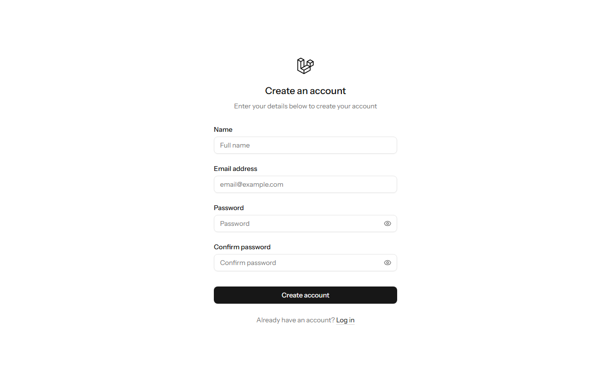
_Sign up_

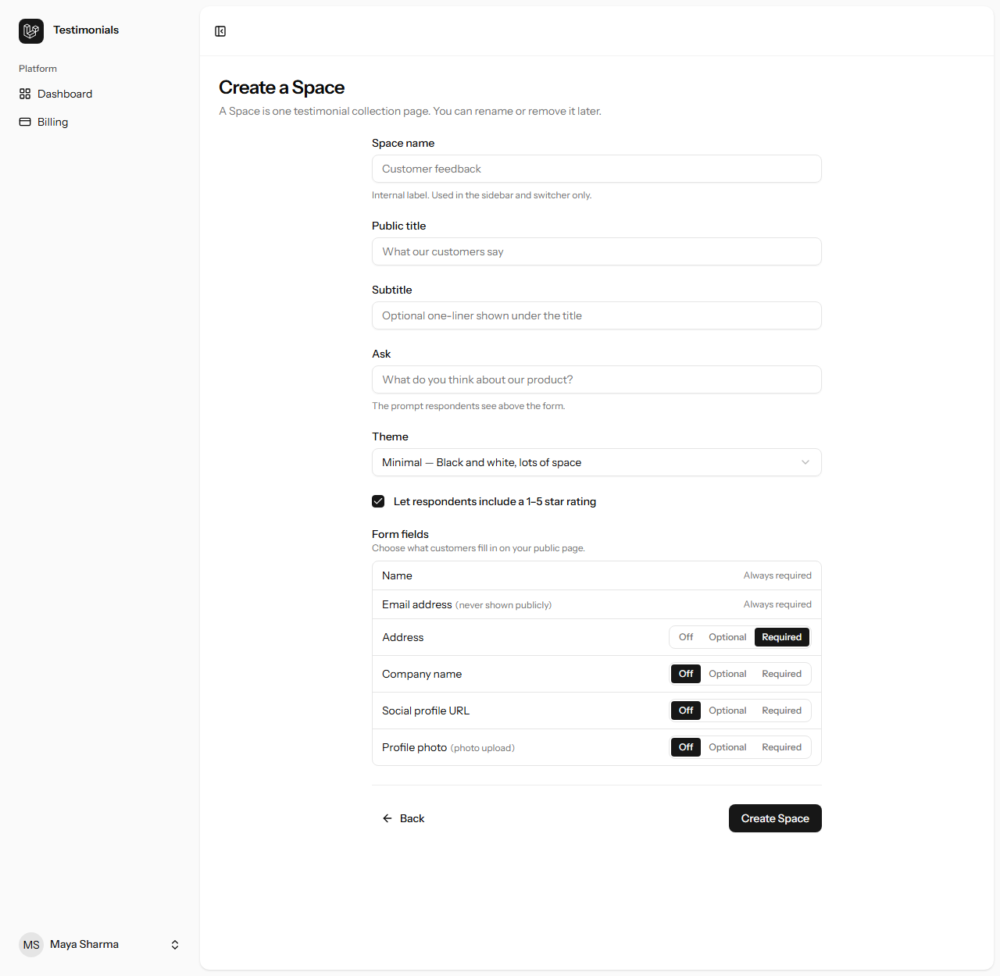
_Create a Space: theme + form fields_

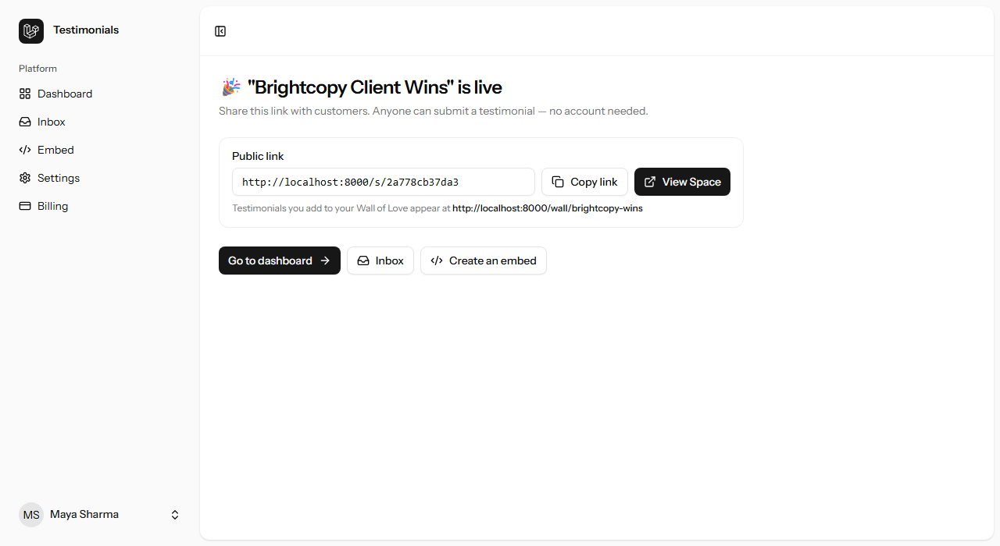
_Success page with public link_

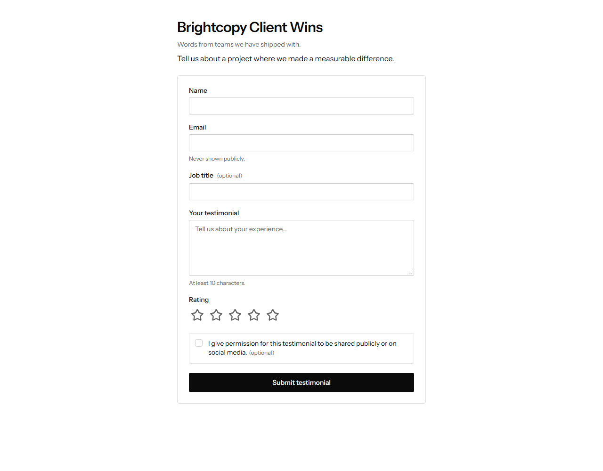
_Public testimonial form_

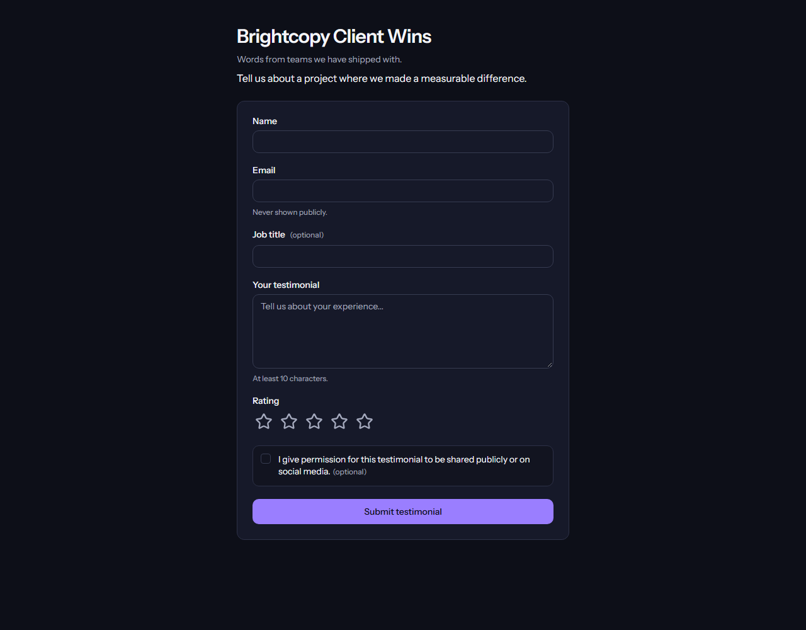
_Modern theme_

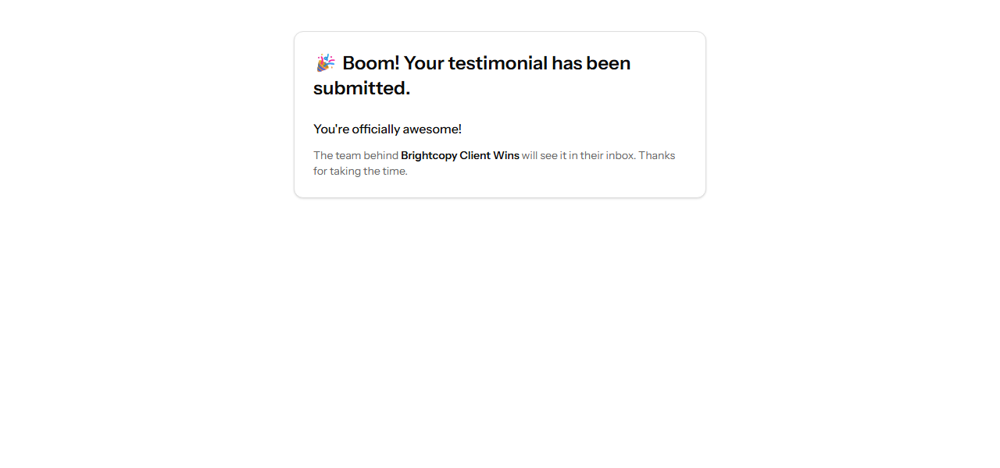
_Confirmation_

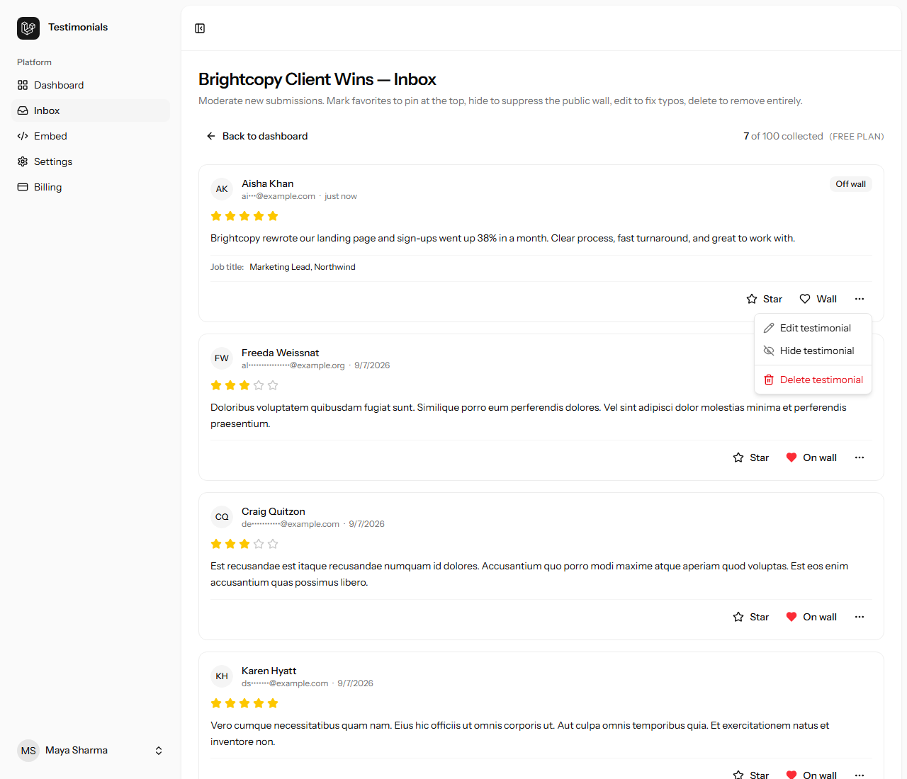
_Inbox moderation_

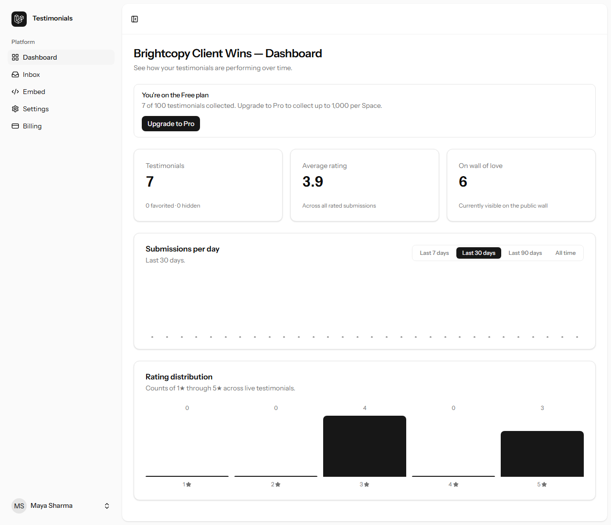
_Dashboard analytics_

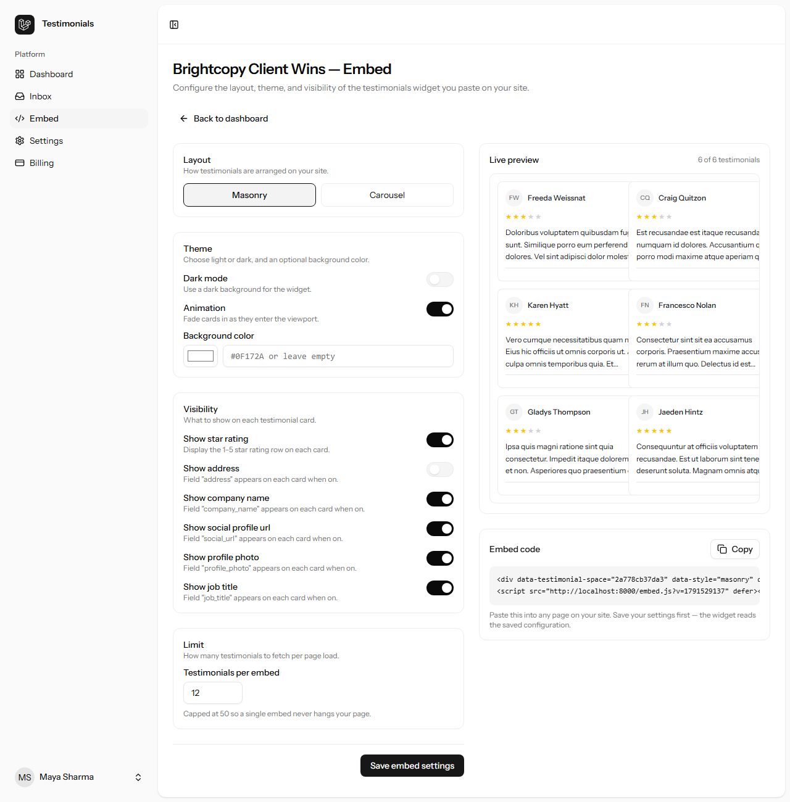
_Embed builder + live preview_

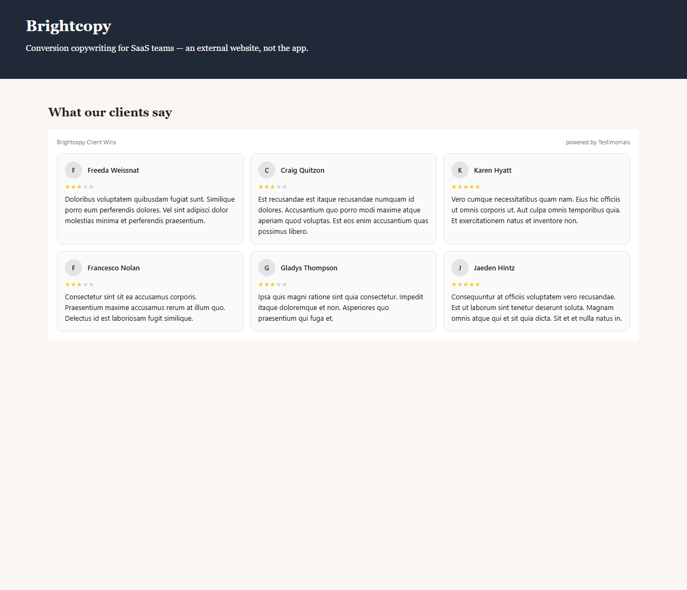
_Embed on an external website_

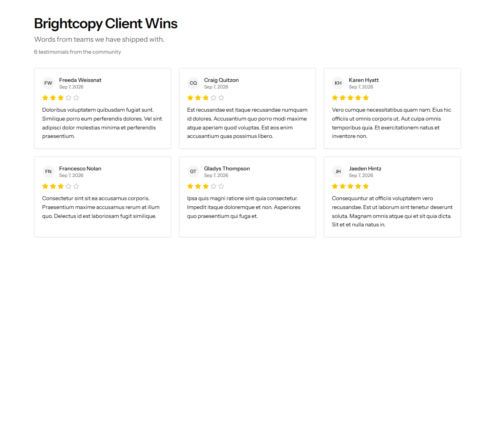
_Public Wall of Love_

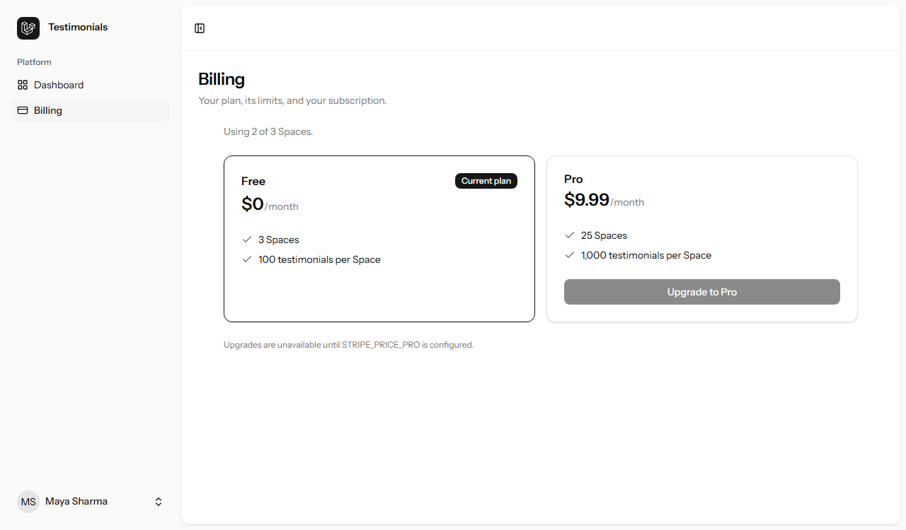
_Billing plans_

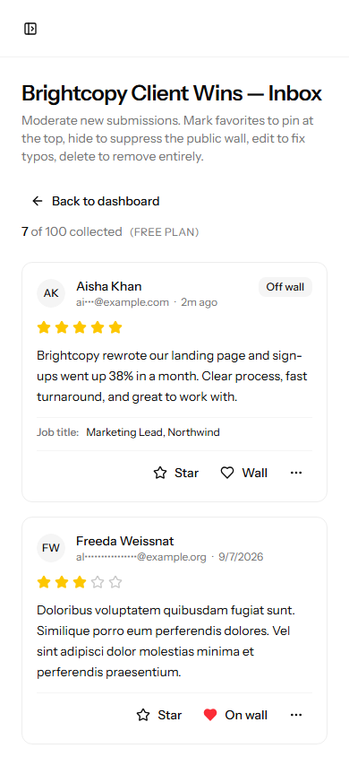
_Mobile view_

## Project structure

```
app/
  Actions/               business logic (Spaces, Inbox, Public, Embeds, Billing, Dashboards, ...)
  Http/Controllers/      thin controllers (Spaces, Public, Embed, Billing, Settings)
resources/js/pages/      Inertia React pages (auth, spaces, public, billing, settings)
openspec/
  changes/archive/       completed feature proposals, specs and tasks
  specs/                 specs of record
docs/
  PRD.md                 product requirements
  data-model.md          schema, ERD and design rationale
  screenshots/           README images
tests/
  Feature/  Unit/        Pest tests
```
